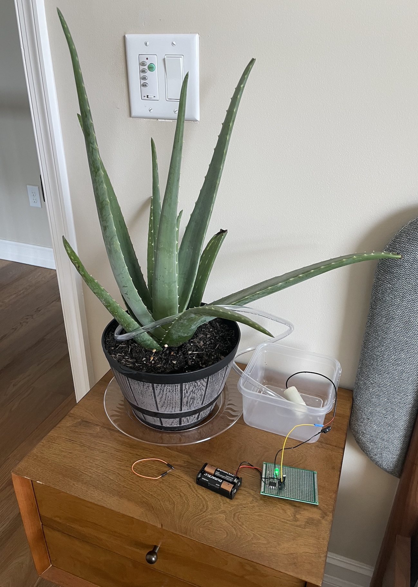

# Automatic Plant Watering System

This is an automatic plant watering system. The frequency of watering can be adjusted
to twice a week, weekly, biweekly, three times a week, or off. There is an LED to
give user feedback while adjusting the settings.

The Arduino code is available here as `plant.ino`. Here is the circuit diagram:

The chip used was an ATtiny85 with an Arduino bootloader. The chip and other circuit
components were soldered onto a Dot PCB (perfboard). Here is a picture of the
final result, connected to a plant:

See
[harysdalvi.com/projects/wabisabi](http://www.harysdalvi.com/projects/wabisabi)
for more details.
